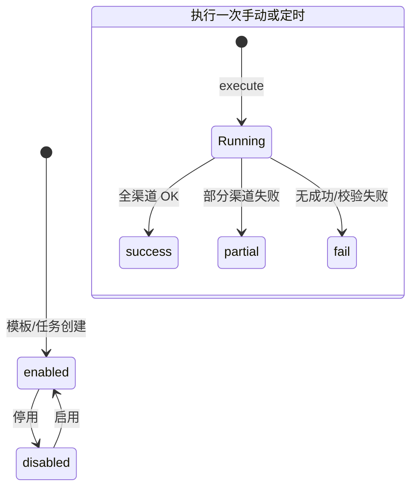

# 风险报告中心 PRD（详尽版 · 含图片占位）

> **HTML 版本**：仓库内同目录 **`PRD-风险报告中心-详尽附图版-V1.html`**，版式与 **`PRD-product-requirements.html`** 一致；§1 Mermaid 依赖 jsDelivr CDN（需联网或自行改成本地脚本）。

> **读前说明**  
> - 图片占位：``，请将 PNG 放入 **`docs/.attachments/`**（与 Markdown 同仓库相对路径）。  
> - **代码真实路径** 为 `src/views/risk/report/*`、`src/components/risk/RiskReport*.vue`；本文档 **「关联代码文件」** 一栏与任务书中的 `src/views/report/*.vue` 命名不同者，以本仓库为准。  
> - **前端路由**：`/risk/report/center|templates|schedules`；**API 建议**：`/api/report/*`、`/api/notification/channels`（网关去前缀策略依环境）。  
> - 标注 **「当前实现」** = 代码已实现；**「上线目标」** = 后端/RBAC/真实文件流待办。

---

## 1. 模块概述


**界面描述**：大标题「风险报告」；灰字副标题展示**当前项目名**并说明模板/任务/历史**按项目隔离**；三个 **Tab 按钮**：报告中心、模板管理、定时任务（`RiskReportLayout.vue` 内 `router-link` + `el-button`）。下方 **`router-view`** 承载子页。布局层还挂载：**模板 Dialog**、**定时任务 Dialog**、简易 **推送 Dialog**（勾选渠道 + 接收人）。

**一句话**：在**项目上下文**下维护报告模板（系统预置 + 项目自建），在**报告中心**按周期与模板**快速生成预览/导出**，或通过**定时任务**按节奏生成并经由**通知方式配置**的渠道推送；历史与执行日志可追溯。

### 1.1 状态流转（文字 + Mermaid）

**模板 `status`**：`enabled` ↔ `disabled`（停用后不可进入快速生成候选、不可被新任务选用——**当前由 `filteredTemplates`/`templateChoices` 过滤实现**）。

**任务 `enabled`**：Switch 切换即 `persist()`。

**执行日志 `status`**：`success` / `partial` / `fail`。



### 1.2 业务规则（模块级）

> **规则 M-1**：切换项目（`useCurrentProject`）时 `window` 派发 `yuyi-project-changed`，`reloadReportState()` 从 `localStorage` 键 **`yuyi-risk-report-proj-{projectId}`** 重载；模板/任务/历史/日志不得串项。

> **规则 M-2**：系统模板 **`tenant_id===0` 且 `isSystem===true`**：列表展示为「系统」来源；**不可删除、不可直接保存编辑**。

> **规则 M-3**：快速生成可选模板 = **`!deleted && status==='enabled' && periodType===quick.period`**。

### 1.3 交互流程（模块级）

1. 用户菜单进入 **风险管理 › 风险报告** → 默认路由 **`/risk/report/center`**。  
2. 用户点 **模板管理** → `push` 至 `/risk/report/templates`，无浏览器整页刷新。  
3. 用户点 **定时任务** → `/risk/report/schedules`。  
4. 用户切换顶部 **当前项目** → 监听到事件后报告模块数据整体重载。

### 1.4 验收标准（≥5）

| ID | Given | When | Then |
|----|--------|------|------|
| OV-01 | 有项目上下文 | 打开 `/risk/report/center` | 显示三列栅格 + 预览区容器 |
| OV-02 | 两项目各有本地数据 | 切换项目 | 列表与预览数据源切换 |
| OV-03 | — | 切换三个子 Tab | URL 与激活态一致 |
| OV-04 | — | F5 刷新 | `localStorage` 数据恢复（演示） |
| OV-05 | — | 控制台无未捕获 Error | 交互完整 |

### 1.5 关联代码文件

- `src/views/risk/report/RiskReportLayout.vue`  
- `src/router/index.js`（`risk/report` 子路由）  
- `src/views/risk/report/riskReportShared.js`  
- `src/data/riskReportProjectState.js`

---

## 2. 报告模板管理

### 2.1 模板列表页


**界面描述**：段首**说明文案**（系统模板全项目可见、项目模板仅本项目）。右侧主按钮 **新增模板**。白色卡片内 **`el-table` size=small**：列 **模板名称**、**类型**（`periodType`→中文）、**来源** Tag（系统/项目）、**状态** Tag（启用/停用）、**操作**（系统：**复制为项目**；项目：**编辑**、**删除**）。  
**当前实现无**：顶栏名称搜索、导入/导出、分页、行内启停 Switch（可作为下一迭代）。

#### 字段定义表（列表行 · 逻辑实体）

| 字段名 | 类型 | 长度 | 必填 | 默认值 | 校验规则 |
|--------|------|------|------|--------|----------|
| id | string | 64 | 是 | `rtpl-{ts}` / `sys-rtpl-*` | 唯一 |
| name | string | 64 | 是 | — | trim；**上线目标：项目内或同类型唯一** |
| periodType | enum | — | 是 | — | `day\|week\|month\|quarter\|year` |
| status | enum | — | 是 | enabled | `enabled\|disabled` |
| isSystem | boolean | — | 是 | 系统 true | — |
| tenant_id | any | — | 是 | 0 或 projectId | — |
| deleted | boolean | — | 是 | false | 软删 |
| chartTheme | string | 32 | 否 | yuyi | `yuyi\|simple` |
| chartSize | string | 8 | 否 | md | `sm\|md\|lg` |
| showDataLabel | boolean | — | 否 | true | — |
| sections | object | — | 是 | DEFAULT_SECTIONS | 见 §2.2 |

#### 交互流程

1. **进入**：`visibleTemplates = allTemplates.filter(t => !t.deleted)`。  
2. **新增**：`openTemplateCreate()` → Dialog `mode=create`。  
3. **编辑**：仅非系统行 → `openTemplateEdit(row)`。  
4. **复制系统**：`copySystemTemplate` → push 新项目模板，`name` 为「原名称 + `（项目副本）`」拼接，`sections` 深拷贝 → `persist()` + `syncQuickTemplate()` + Toast。  
5. **删除项目模板**：Confirm → `deleted=true`。**当前未校验**定时任务引用。**上线目标**：`DELETE /api/report/templates/{id}` 返回 **409** 及引用数。

#### 业务规则

> **规则 T-L-1**：`row.isSystem || row.tenant_id===0` 时 **不允许删除**；触发 `ElMessageBox.alert` 说明，仅可复制。  

> **规则 T-L-2**：删除采用 **软删除**，列表与快速生成均过滤 `deleted`。  

> **规则 T-L-3**：**上线目标**——删除前校验 `schedule_task.template_id` 引用，提示「该模板已被 X 个定时任务使用…」。  

#### 异常处理

| 场景 | 用户可见反馈 |
|------|----------------|
| 删系统模板 | Alert：系统预置模板不可删除 |
| 删除取消 | 无变更 |
| **（上线）** 引用冲突 | Toast/Dialog + HTTP 409 |

#### 验收标准（≥5）

| ID | Given | When | Then |
|----|--------|------|------|
| TL-01 | 三系统模板存在 | 打开页 | 均有「系统」Tag，无删除按钮 |
| TL-02 | — | 复制为项目 | 出现「项目」行 + 「（项目副本）」后缀 |
| TL-03 | 项目模板一条 | Confirm 删除 | 行消失，`deleted` 真 |
| TL-04 | — | （上线）绑定任务删模板 | 409 + 文案含 X |
| TL-05 | — | （上线）分页/检索 | API `page`、`keyword` 生效 |

#### 关联代码文件

- `src/views/risk/report/RiskReportTemplatesPage.vue` ← 对照任务书 `TemplateList.vue`  
- `src/views/risk/report/riskReportShared.js`（`removeTemplate`、`copySystemTemplate`、`visibleTemplates`）  
- `src/data/riskReportMock.js`（`getSystemReportTemplates`、`PERIOD_OPTIONS`）

---

### 2.2 新增/编辑模板弹窗


**界面描述**：`el-dialog` 宽640、`destroy-on-close`。表单项：**模板名称** maxlength64 word-limit；**模板类型** 下拉全集，**编辑态 disabled**。**包含内容**：9×`el-checkbox`（header、overviewCards、levelPie、trendLine、regionTable、ruleStats、efficiencyBar、openRisksTable、footer）。**图表样式**：主题、尺寸、显示数据标签。Footer **取消 / 保存**。**当前**：无内置「预览」按钮（可作增强）。

#### 字段定义表

| 字段名 | 类型 | 长度 | 必填 | 默认值 | 校验规则 |
|--------|------|------|------|--------|----------|
| name | string | 64 | 是 | 见模式 | Element `required` blur |
| periodType | enum | — | 是 | create:week | `required`；edit 禁用 |
| sections.\* | boolean | — | 否 | 见 DEFAULT_SECTIONS | **上线建议**：至少一章 true |
| chartTheme | enum | — | 否（建议必填） | yuyi | 选项枚举 |
| chartSize | enum | — | 否（建议必填） | md | sm/md/lg |
| showDataLabel | boolean | — | 否 | true | select 布尔 |

#### 交互流程

1. 打开时：`record` 有值则合并 `sections` 到默认值对象。  
2. **保存**：`validate()` → emit `saved` payload → **`ElMessage.success`** → 关闭。  
3. **`onTemplateSaved`**：`create` 追加至 `projectTemplates`；若 **编辑对象是系统模板** → **`ElMessage.warning`** 并 abort。  
4. `syncQuickTemplate()` 校正 `quick.templateId`。

#### 业务规则

> **规则 T-F-1**：系统模板**不得**在项目侧直接 `Object.assign` 保存。  

> **规则 T-F-2**：**创建后 `periodType` 不可改**（编辑 UI 禁用）。  

> **规则 T-F-3**：保存后触发 `persist()`，保证刷新可恢复。

#### 异常处理

- 表单校验失败：字段下红字，不提交。  
- **（上线）** 409 名称重复：**保持弹窗**，展示服务端 `message`。

#### 验收标准（≥5）

| ID | Given | When | Then |
|----|--------|------|------|
| TF-01 | 新建 | 空名称保存 | 「请输入模板名称」 |
| TF-02 | 项目模板编辑 | 改章节保存 | `sections` 更新且预览随之变 |
| TF-03 | 模拟保存系统模板 | `onTemplateSaved` | Warning，数据不落 |
| TF-04 | 编辑态 | 观察类型框 | disabled |
| TF-05 | **（上线）** | POST 重名 | 409 |

#### 关联代码文件

- `src/components/risk/RiskReportTemplateDialog.vue` ← 对照 `TemplateForm.vue`  
- `src/data/riskReportMock.js`（`DEFAULT_SECTIONS`、`CHART_*_OPTIONS`）

---

### 2.3 报告生成与预览（报告中心）


**界面描述**：**左卡「快速生成」**：周期 `el-select`（`PERIOD_OPTIONS`）；只读 **时间范围** `el-input`（演示文案 `timeRangeText`）；**模板** `el-select filterable`；按钮 **生成报告**、**导出**。**中卡「我的报告」**：可点列表 + 链到预览。**右卡「定时任务」**：最多3条 + **管理任务**。下方大卡片：**预览标题**、**v-loading**、**PDF/Excel/Word/推送** 按钮组；按 `activeSections` 条件渲染各块（`ChartContainer`、mock 表等）。

#### 字段定义表（快速生成）

| 字段名 | 类型 | 长度 | 必填 | 默认值 | 校验规则 |
|--------|------|------|------|--------|----------|
| quick.period | enum | — | 是 | week | 变更→重算模板与 preview |
| quick.templateId | string | 64 | 条件 | 自动首项 | **无模板时 generate → warning** |
| previewRefId | string | — | 否 | '' | 用于高亮历史 |
| previewLoading | boolean | — | — | false | 生成过程 |

#### 交互流程

1. **改周期** → `syncQuickTemplate()`：若当前 id 不在 `filteredTemplates` → 选首项或置空。  
2. **生成报告**：无 `templateId` → `ElMessage.warning('请选择与周期匹配的已启用模板')`。  
3. 否则 `previewLoading=true` → **450ms** 定时器（模拟）→ `myReports.unshift`、设 `previewRefId`、`persist()`、`ElMessage.success('报告已生成（模拟），已加入「我的报告」')`。  
4. **改模板** → `buildPieOption(showDataLabel)` 更新饼图。  
5. **导出**：`exportCurrent(fmt)` → 仅 **Toast 模拟**，文件名 `项目_周期_日期.ext`。  
6. **推送**（布局层 Dialog）：确认 → Toast 模拟。

#### 业务规则

> **规则 QG-1**：`filteredTemplates` 必须同时满足 **启用 + 未删 + period 匹配**。  

> **规则 QG-2**：`activeSections` 若模板无 `sections` 字段则使用 **代码内默认对象**（含 overview/饼/趋势/区域/明细等默认开）。  

> **规则 QG-3**：源码存在 `MAX_REPORT_RANGE_DAYS=90` 注释语义，**当前 `generateReport` 未使用**——列为 **产品与实现对齐缺口**。

#### 异常处理

| 场景 | 反馈 |
|------|------|
| 无可选模板 | warning |
| （执行链路）reject | **（定时任务路径）** `ElMessage.error` |

#### 验收标准（≥5）

| ID | Given | When | Then |
|----|--------|------|------|
| QG-01 | 有启用周报模板 | 点生成 | 历史多一条 + success Toast |
| QG-02 | 停用全部周报模板（构造） | 点生成 | warning |
| QG-03 | 换 period | 模板下拉变 | templateId 自动纠正 |
| QG-04 | — | 导出 word | Toast 后缀 `.docx` |
| QG-05 | — | （上线真实导出） | 返回文件流附件 |

#### 关联代码文件

- `src/views/risk/report/RiskReportCenter.vue` ← 含「快速生成+预览」（对照 `QuickGenerate.vue` 合并形态）  
- `src/views/risk/report/riskReportShared.js`  
- `src/data/riskReportMock.js`（图表 option 构建）

---

### 2.4 历史报告管理（「我的报告」）


**界面描述**：中列列表展示 `title` + `generatedAt`；点击 → 同步 `quick.period`/`templateId` 并 `refreshPreview()`。**当前**：无行内「下载/删除」；持久化为 **localStorage 数组**。

#### 字段定义表

| 字段名 | 类型 | 长度 | 必填 | 默认值 | 校验规则 |
|--------|------|------|------|--------|----------|
| id | string | — | 是 | rh-\* | 唯一 |
| title | string | — | 是 | — | — |
| periodType | enum | — | 是 | — | — |
| templateId | string | — | 否 | — | — |
| templateName | string | — | 否 | — | — |
| generatedAt | string | — | 是 | — | — |
| source | string | — | 否 | — | 如 `schedule_manual` |
| scheduleId | string | — | 否 | — | 手动执行写入 |

#### 交互流程

1. 点击历史行 → `loadHistoryReport(r)`。  
2. **（上线）** `GET /api/report/history` 分页；`DELETE` 删元数据与 OSS。**（上线）** `GET …/download?format=` 签名链接。

#### 业务规则

> **规则 H-1**：列表数据 **按项目隔离**。  

> **规则 H-2**：仅 **项目管理员及以上** 可删历史。**当前前端无删除 UI**。

#### 验收标准（≥5）

| ID | Given | When | Then |
|----|--------|------|------|
| H-01 | 两条历史 | 点第二条 | preview 与高亮切换到第二条语义 |
| H-02 | — | （上线删除）管理员 | DB+OSS 一致 |
| H-03 | — | （上线）业务员 | DELETE 403 |
| H-04 | — | （上线）过期签名 URL | 友好错误页 |
| H-05 | 手动执行写入历史 | When 成功后 | `source` 等扩展字段可查 |

#### 关联代码文件

- `RiskReportCenter.vue`、`riskReportShared.js`

---

## 3. 定时任务管理

### 3.1 任务列表页


**界面描述**：**筛选卡片**：任务名称关键字、`状态`、`周期`、`最近执行`、查询/重置；**新增任务**按钮。**表格**：名称、推送渠道摘要、`cycleLabel`、`runTime`、`lastRunAt`、启用 Tag、`最近执行结果`（链接打开 **MessageBox 详情**，无日志则「暂无」）、操作：**Switch**（启停）、编辑、执行、历史、删除。  
**执行历史 Drawer**：840px，`historyRows` 按 `schedule_id` 过滤排序。

#### 字段定义表（列表行）

| 字段名 | 类型 | 长度 | 必填 | 默认值 | 校验规则 |
|--------|------|------|------|--------|----------|
| name | string | 80 | 是 | — | Dialog |
| cycle | enum | — | 是 | daily | daily/weekly_mon/monthly_1/cron |
| runTime | string | 5 | 条件 | 09:00 | HH:mm；cron 除外 |
| cronExpr | string | 64 | 条件 | 0 9 * * * | cron 必填 |
| templateId | string | — | 是 | — | 必须与周期推导类型一致 |
| templateName | string | — | 否 | — | saved 回填 |
| notifyMethodIds | string[] | — | 是 | 默认勾选 | ≥1 |
| recipientsMail/Ding/Wework | string | 1k± | 条件 | '' | mail 勾选必填 trim |
| enabled | boolean | — | 是 | true | — |

#### 交互流程

1. `filteredSchedules` 响应式筛选（关键字 includes、enabled、cycle、lastExec）。  
2. **Switch**：`onScheduleToggle` + `persist` + Toast。  
3. **删除**：confirm → splice 任务 + **过滤掉该 id 的全部执行日志**。  
4. **历史 Drawer**：openHistory → table + 行内「详情」。  
5. **最近执行摘要按钮**：无 log → `ElMessage.info('暂无执行记录')`。

#### 业务规则

> **规则 S-L-1**：**「查询」按钮**保留语义但 `applyFilters` 为空——过滤由 computed 即时生效。

> **规则 S-L-2**：推送摘要：`notifyMethodIds` 映射 `getNotificationMethod(id).name`。

> **规则 S-L-3**：**上线目标**——`(project_id, template_id, normalized_schedule_fingerprint)` **唯一约束**（防重复投递）。

> **规则 S-L-4**：**上线目标**——执行层 **分布式锁** 防并行（当前仅靠前端 Loading）。

#### 验收标准（≥5）

| ID | Given | When | Then |
|----|--------|------|------|
| SL-01 | 多条任务 | keyword 筛选 | 子串命中 |
| SL-02 | 启停混合 | filter 停用 | 仅停用 |
| SL-03 | — | Toggle | persist + toast |
| SL-04 | 删任务 | confirm | 任务与相关 logs 清空 |
| SL-05 | 无日志 | 点摘要 | info 提示 |

#### 关联代码文件

- `src/views/risk/report/RiskReportSchedulesPage.vue` ← **含 Drawer**（对照任务书独立 `ExecutionHistory.vue`）

---

### 3.2 新增/编辑任务弹窗


**界面描述**：760px；字段顺序见 **`RiskReportScheduleDialog.vue`**。推送块含 **Checkbox 组**绑定 `notifyMethodIds`（`listMethodsForSchedulePush()`），条件收件人。**Radio 启用/停用**。

#### 字段定义表（同上 + 表单校验）

| 校验 prop | 规则摘要 |
|-----------|----------|
| name | required |
| templateId | required |
| notifyMethodIds | 自定义：数组 length≥1 |
| runTime | 非 cron → required |
| cronExpr | cron → required trim |
| recipientsMail | 勾选 mail → required trim |

#### 交互流程

1. **`templateChoices`**：`!deleted && enabled` 且若非 cron：`periodType === cycleToPeriodType(cycle)`。  
2. **周期切换** → 若当前模板不在候选 → **自动选中第一项**。  
3. **save**：表单过 → **二次校验** `tpl.periodType === expectedPeriod`（cron 免检）→ 失败 **`ElMessage.error('任务周期与报告模板类型不一致…')`**。  
4. emit `saved`：**展开** `channelEmail/Ding/Wework` 兼容字段。

#### 业务规则

> **规则 S-F-1**：`listMethodsForSchedulePush` **排除连通失败渠道与 sms**（与 mock 常量一致）。

> **规则 S-F-2**：**邮件收件人**：保存层仅非空校验；执行层 `splitEmails` 支持 `;；,,换行`。  
> **规则 S-F-3**：**上线**：逐邮箱正则校验 API 侧。

#### 验收标准（≥5）

| ID | Given | When | Then |
|----|--------|------|------|
| SF-01 | 每日 cycle | 打开模板下拉 | 仅 day 模板 |
| SF-02 | — | 不选通知保存 | 「请至少选择一种通知方式」 |
| SF-03 | 勾选邮件 | 收件空 | 「勾选邮件时需填写收件人邮箱」 |
| SF-04 | 非 cron + 模板类型不符 | submit | Error 阻断 |
| SF-05 | cron | 表达式空 | 「请填写 Cron 表达式」 |

#### 关联代码文件

- `src/components/risk/RiskReportScheduleDialog.vue` ← `ScheduleForm.vue`

---

### 3.3 立即执行与执行历史详情


**界面描述**：**执行**：`ElMessageBox.confirm` 文案含任务名→ **全屏 Loading**→ `executeScheduleTask`→ Toast **success/warning/error**（5.5–6.5s）。**历史 Drawer**：表格列 **执行时间 / 结果 emoji / 报告大小格式化 / 渠道 / 接收人 / 详情**；详情同 **MessageBox.alert**(`formatScheduleExecutionDetail`)。

#### 交互流程（`executeScheduleTask` 核心）

1. 延时 **520–900ms**。  
2. **无 templateId** → `fail`，`error_message=未绑定报告模板`。  
3. **notifyMethodIds 解析为空且无兼容 channel\***→ `fail` `未配置可用的通知方式`。  
4. **逐渠道**：Mail 校验 **SMTP host、收件人**；Ding/Wework 校验 **webhookUrl**；失败记入 `errors`。  
5. **聚合**：`status` ∈ success/partial/fail；写 `scheduleExecutionLogs`；可能 **myReports.unshift**。

#### 业务规则（执行引擎）

> **规则 EX-1**：`splitEmails(mailRaw)`：`;；,，` 与换行分隔。  

> **规则 EX-2**：任一渠道全程无「已发送/已推送」成功记录且 `errors` 非空→ **fail**。  

> **规则 EX-3**：部分成功→ **partial**，Toast **`ElMessage.warning`**。  

#### 验收标准（≥5）

| ID | Given | When | Then |
|----|--------|------|------|
| EX-01 | 合法配置 | Confirm 执行 | log 入账 + toast success |
| EX-02 | 无模板 | 执行 | fail toast |
| EX-03 | 无收件人但有钉钉 | 执行 | 仍可 success（若 ding OK） |
| EX-04 | Drawer | 点详情 | 弹窗内容与 `detail` 或拼装一致 |
| EX-05 | **（上线）** | 双击并发执行 | **409 / 423** |

#### 关联代码文件

- `src/views/risk/report/riskReportShared.js`（`runScheduleOnce`）  
- `src/data/scheduleExecutionMock.js`

---

## 4. 推送方式整合


**界面描述**：灰色 **推送设置** 卡片；勾选 **通知方式** 来自 **`listMethodsForSchedulePush`**（内部读 `notificationMethodMock`/`localStorage`）。提示文案指明 **SMTP/Webhook 在「通知方式配置」维护**。任务执行：`executeScheduleTask` 通过 `getNotificationMethod` 解密侧（演示读 mock 字段）。

#### 字段/API 对齐（任务书）

| 约定 | 实现参考 |
|------|----------|
| `GET /api/notification/channels?status=启用` | 对齐 `listMethodsForSchedulePush` 过滤语义 |
| `notification_channel` 表 | mock：`notificationMethodMock.js` |

#### 交互流程

1. 打开任务表单 → computed `pushMethodOptions`。  
2. `watch(pushMethodIds)`：**剔除已下架渠道 id**。  
3. **执行任务**：服务端按 id 加载 **SMTP / Webhook** → 邮件附 **PDF**；钉钉 **Markdown+链接**。  

#### 业务规则

> **规则 P-1**：**SSRF**：Webhook URL **禁止解析到私网/metadata**——服务端校验。

> **规则 P-2**：密钥不落前端日志明文。

#### 验收标准（≥5）

| ID | Given | When | Then |
|----|--------|------|------|
| P-01 | 无可用渠道 | 打开任务 | 黄字提示先去配置通知 |
| P-02 | ding testStatus=fail | — | **不出现在**可多选列表 |
| P-03 | **（上线）** SMTP 被拒 | execute | partial + 邮件子错误 |
| P-04 | **（上线）** 恶意 URL POST | channel | **400** |
| P-05 | 钉钉无 @人 | execute | receivers 摘要「运维群（未 @ 单人）」级文案 |

#### 关联代码文件

- `RiskReportScheduleDialog.vue`  
- `src/data/notificationMethodMock.js`  
- 页面：`src/views/security/NotificationMethodConfigPage.vue`

---

## 5. 权限矩阵


| 能力 | 超级管理员 | 项目管理员 | 业务用户 |
|------|------------|------------|----------|
| 模板管理（项目侧） | ✓（全局策略） | ✓ | 只读/**无按钮** |
| 系统模板维护 | ✓ tenant=0 | ✗ | ✗ |
| 快速生成/预览 | ✓ | ✓ | ✓（可收窄） |
| 导出真实文件 | ✓ | ✓ | **条件** |
| 定时任务 CRUD / 执行 | ✓ | ✓ 本项目 | ✗ |
| 历史删除 | ✓ | ✓ 本项目 | ✗ |

**当前代码**：上述 RBAC **未挂载**——**上线**补 `router meta` + 接口 JWT。

---

## 6. 异常与错误码


| 码 | 场景 | 用户提示（中文） |
|----|------|------------------|
| 400 | JSON 校验/邮箱非法/Webhook SSRF | 参数不合法 |
| 403 | 角色不足 | 无权限 |
| 404 | 模板/任务/历史/文件缺失 | 资源不存在 |
| 409 | 名重复 / 模板被引用 / 任务指纹 dup | **服务端具体 message** |
| 423 | 执行锁占用 | **任务执行中请稍后** |
| 500 | 生成器异常 | 「报告生成失败，请稍后重试」 |

**前端网络错误**：与其它模块统一 **「操作失败，请稍后重试」**。

---

## 7. API 清单（与用户任务书对照）

| 方法 | 路径 | 说明 |
|------|------|------|
| GET | `/api/report/templates` | 分页筛选 |
| POST | `/api/report/templates` | 新增 |
| PUT | `/api/report/templates/{id}` | 更新 |
| DELETE | `/api/report/templates/{id}` | 删（**引用校验**） |
| POST | `/api/report/generate` | `templateId, dateRange/dateFrom-dateTo, format` |
| GET | `/api/report/history` | 列表 |
| DELETE | `/api/report/history/{id}` | 删除 |
| GET | `/api/report/schedules` | 列表 |
| POST | `/api/report/schedules` | 新建 |
| PUT | `/api/report/schedules/{id}` | 更新 |
| DELETE | `/api/report/schedules/{id}` | 删除 |
| POST | `/api/report/schedules/{id}/execute` | 立即执行（**建议异步 job**） |
| GET | `/api/report/schedules/{id}/history` | 等价本仓库 Drawer 数据源 |

---

## 8. DDL 示例（与任务书表名对齐）

```sql
CREATE TABLE report_template (
  id VARCHAR(64) PRIMARY KEY,
  name VARCHAR(128) NOT NULL,
  type VARCHAR(16) NOT NULL COMMENT 'day/week/month',
  config JSON NOT NULL,
  status VARCHAR(16) NOT NULL DEFAULT 'enabled',
  is_system TINYINT(1) NOT NULL DEFAULT 0,
  project_id BIGINT NULL,
  create_time DATETIME(3) NOT NULL DEFAULT CURRENT_TIMESTAMP(3),
  update_time DATETIME(3) NOT NULL DEFAULT CURRENT_TIMESTAMP(3) ON UPDATE CURRENT_TIMESTAMP(3)
);

CREATE TABLE report_history (
  id VARCHAR(64) PRIMARY KEY,
  template_id VARCHAR(64) NOT NULL,
  file_path VARCHAR(512) NOT NULL,
  file_size BIGINT,
  generate_time DATETIME(3) NOT NULL,
  date_range JSON NOT NULL,
  project_id BIGINT NOT NULL
);

CREATE TABLE schedule_task (
  id VARCHAR(64) PRIMARY KEY,
  name VARCHAR(160) NOT NULL,
  template_id VARCHAR(64) NOT NULL,
  cron VARCHAR(64) NOT NULL,
  push_channels JSON NOT NULL,
  email_receivers VARCHAR(1024),
  dingtalk_mentions VARCHAR(512),
  status VARCHAR(16) NOT NULL DEFAULT 'enabled',
  project_id BIGINT NOT NULL
);

CREATE TABLE schedule_execution_log (
  id BIGINT PRIMARY KEY AUTO_INCREMENT,
  task_id VARCHAR(64) NOT NULL,
  execute_time DATETIME(3) NOT NULL,
  status VARCHAR(16) NOT NULL,
  result_message TEXT,
  file_size BIGINT,
  push_result JSON
);

CREATE TABLE notification_channel (
  id VARCHAR(64) PRIMARY KEY,
  type VARCHAR(32) NOT NULL COMMENT 'email, dingtalk',
  name VARCHAR(128) NOT NULL,
  config JSON NOT NULL,
  status VARCHAR(16) NOT NULL DEFAULT 'enabled'
);
```

---

## 9. 全局业务规则汇总（代码逆向 · 单列）

> **G-1** 持久化 Key：`yuyi-risk-report-proj-{projectId}` JSON：`projectTemplates, schedules, myReports, scheduleExecutionLogs`。  

> **G-2** 系统模板自 `getSystemReportTemplates()` 注入，不落 `projectTemplates` 存储数组。  

> **G-3** `seedScheduleTasks/seedScheduleExecutionLogs`：新项目首次打开注入演示任务与日志（`riskReportMock`/`scheduleExecutionMock`）。  

> **G-4** `generateReport`：固定 **450ms** 延迟；不向服务端请求。  

> **G-5** `executeScheduleTask`：**520–900ms** 随机延迟；返回值驱动 Toast 三色策略。  

> **G-6** Cron 模式下任务保存 **跳过**模板周期一致性前端校验分支。  

> **G-7** 列表「推送」在无 `notifyMethodIds` 时用旧 `channelEmail/Ding/Wework` 推断中文标签。  

> **G-8** 删除模板 **尚未**校验 schedule 绑定（后端必补）。  

> **G-9** 删除 schedule **级联删**本项目下该 id 的执行日志前端副本。  

> **G-10** `formatLastResultSummary`：partial 时按 `error_message` 关键词粗分「邮件失败/钉钉失败/企微失败」。  

---

## 10. 文档变更

| 版本 | 日期 | 说明 |
|------|------|------|
| V1.0 | 2026-05-07 | 首版：图片占位 + 代码逆向规则 + 每节 ≥5 验收 |

---

**END**
